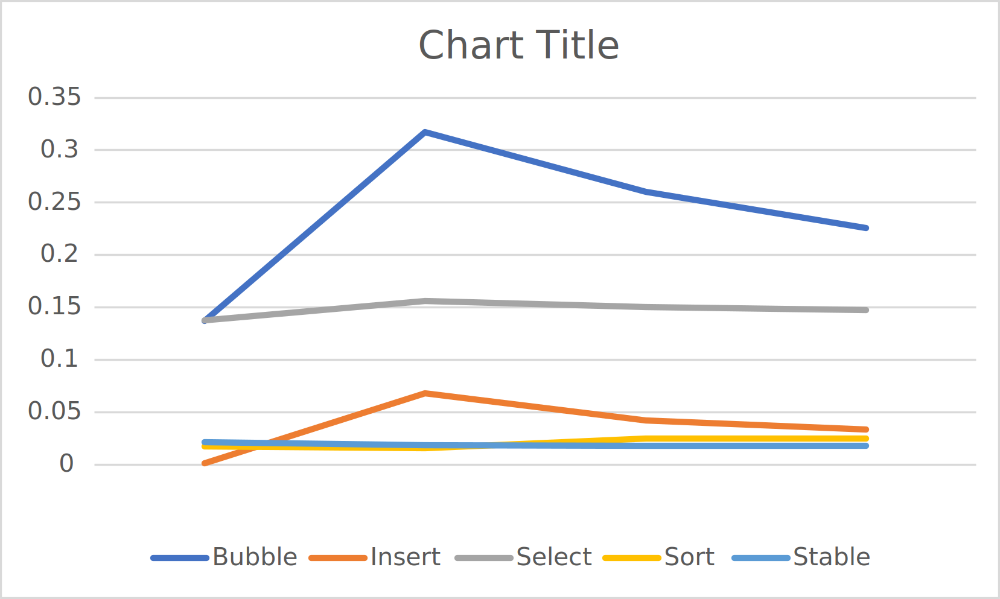
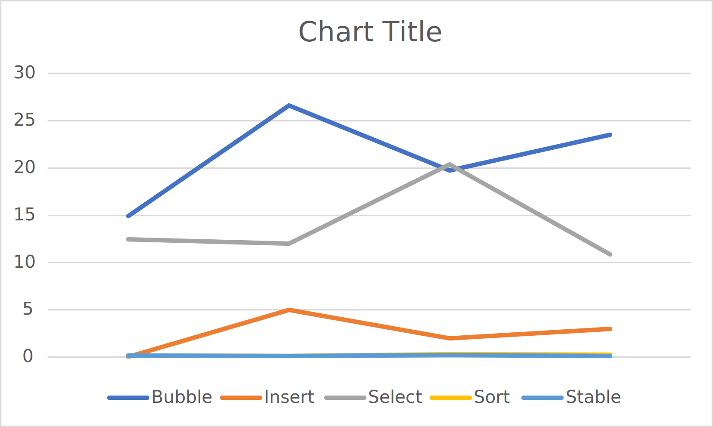
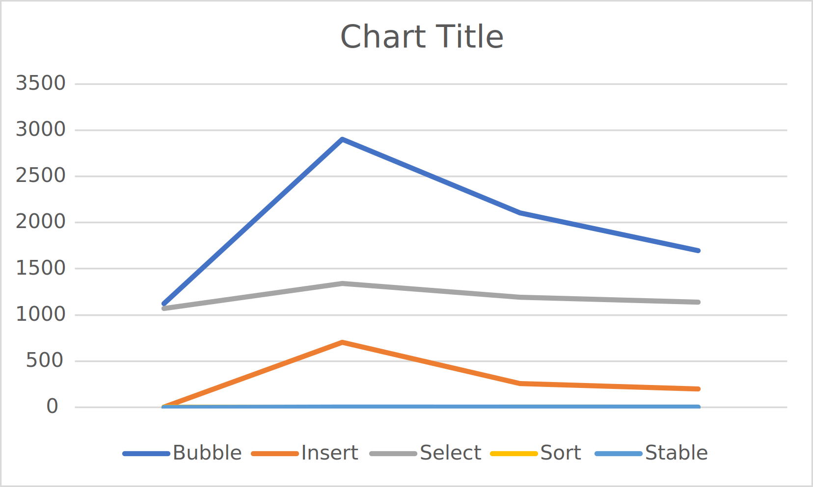

# L1 - Complexité
Etant donné l'incomprehension totale de ce projet,vous trouverz le fichier csv [ici](csv/data.csv)

Et les 3 captures representant 3 tailles différantes N = 100, 1000 et 10000 :

### N 100

### N 1000

### N 10000

