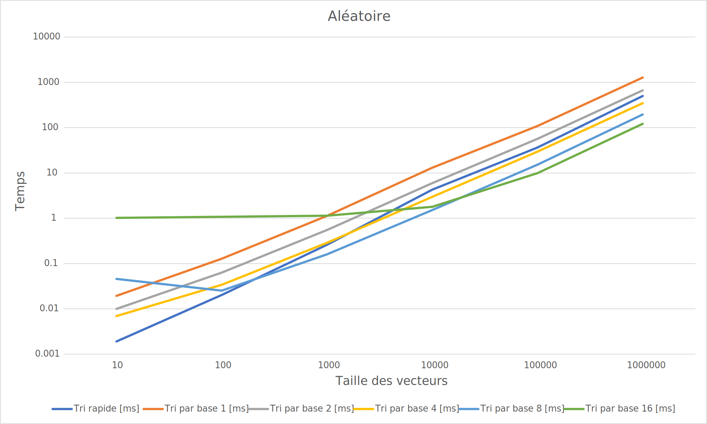
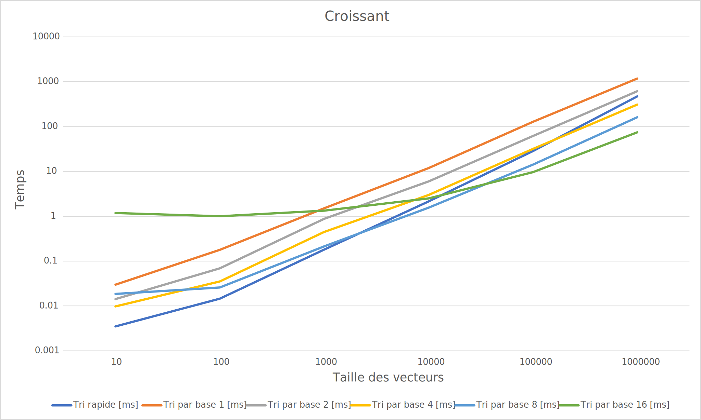
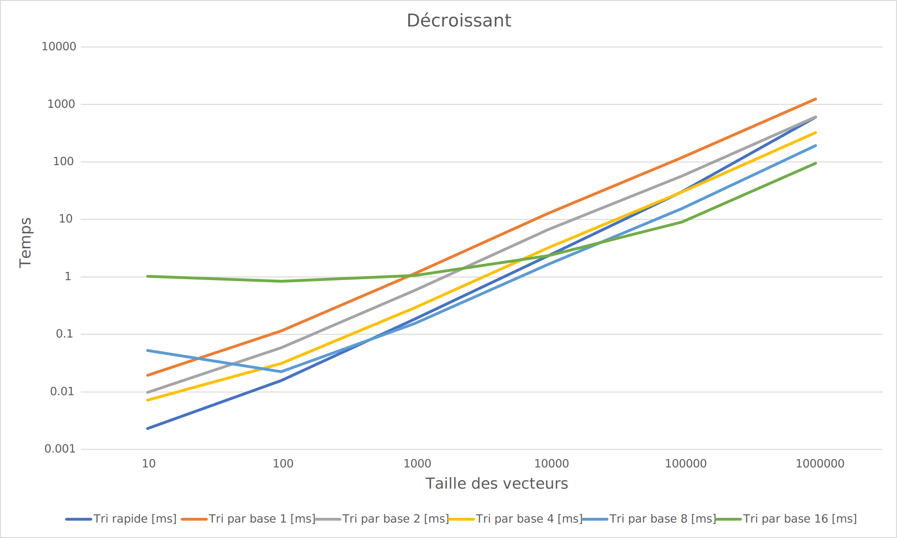
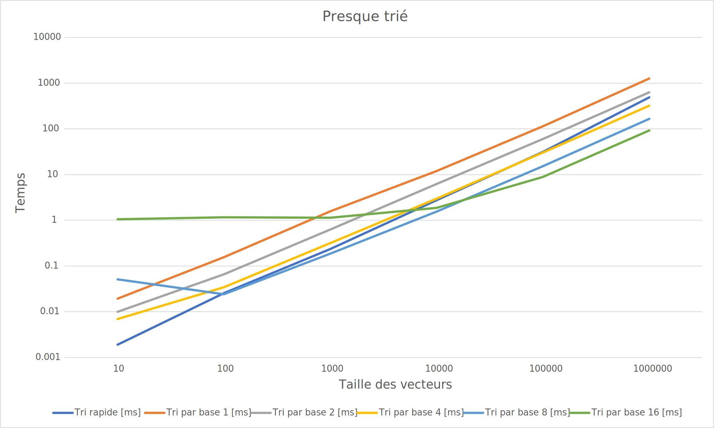

# L3 - Tris, Groupe D <br> [Auberson **Kevin**, Faria dos Santos **Dani Tiago**, Gonin **Guillaume**]
1. Introduction
2. Programme TestTris <br>
2.1 Structure du test<br>
2.2 Output <br>
3. Programme MesureTempsTri<br>
3.1 Main du fichier<br>
3.2 Graphiques des mesures<br>
   3.2.1 Aléatoire<br>
   3.2.2 Croissant<br>
   3.2.3 Décroissant<br>
   3.2.4 Presque trié<br>
4. Conclusion <br>

<hr>

# Introduction
Ce rapport permet de démontrer le fonctionnement du code fourni. En reprenant et respectant les prototypes fournis, il était demandé de les compléter afin d'effectuer les derniers tris vus en cours et de tester leurs efficacités sous 4 conditions différentes ; CROISSANT, DECROISSANT, ALEATOIRE et PRESQUE_TRIE.<br><br>
Une fois triés, nous avons exporté leur temps dans des fichiers csv disponibles. [Ici](csv/).

## Programme TestTris
Ce programme permet de vérifier que les 4 fonctions, **partition**, **tri_rapide**, **tri_comptage** et **tri_par_base** fonctionnent correctement.

Des vecteurs composés de valeur numérique, pré mélangés de façon *aléatoire*, allant de **1 à 25** ont été généré arbitrairement pour tester les résultats.  De plus, des vecteurs de diverses tailles pré mélangés *croissant*, *décroissant* et *presque triés* ont eux aussi réussi les tests avec succès.

*NB : Pour les tris par base, chacune des bases a été elle aussi essayée avec des `NBITS` de 1 à 16*

### Structure du test
```C++
cout << "=======================================================================================" << endl << endl;

   //Test partition---------------------------------------------------------------
   std::vector<size_t> vPartition = genererVecteur<size_t>(25, ALEATOIRE);
   testPartition<size_t, vector<size_t>::iterator>(vPartition);
   //Fin du test partition   -----------------------------------------------------

   cout << "=======================================================================================" << endl << endl;

   //Test Tri rapide--------------------------------------------------------------
   std::vector<size_t> vTriRapide = genererVecteur<size_t>(25, ALEATOIRE);
   testTriRapide<size_t, vector<size_t>::iterator>(vTriRapide);
   //Fin du test du tri rapide-----------------------------------------------------

   cout << "=======================================================================================" << endl << endl;

   //Test Tri comptage---------------------------------------------------------------
   std::vector<size_t> vTriComptage = genererVecteur<size_t>(25, ALEATOIRE);
   testTriComptage<size_t>(vTriComptage);
   //Fin du test du tri comptage-----------------------------------------------------

   cout << "=======================================================================================" << endl << endl;

   //Test Tri radix---------------------------------------------------------------
   std::vector<size_t> vTriParBase1 = genererVecteur<size_t>(25, ALEATOIRE);
   testTriParBase<size_t, vector<size_t>::iterator, 1>(vTriParBase1);
   cout << "---------------------------------------------------------------------------------------" << endl << endl;
   std::vector<size_t> vTriParBase2 = genererVecteur<size_t>(25, ALEATOIRE);
   testTriParBase<size_t, vector<size_t>::iterator, 2>(vTriParBase2);
   cout << "---------------------------------------------------------------------------------------" << endl << endl;
   std::vector<size_t> vTriParBase4 = genererVecteur<size_t>(25, ALEATOIRE);
   testTriParBase<size_t, vector<size_t>::iterator, 3>(vTriParBase4);
   cout << "---------------------------------------------------------------------------------------" << endl << endl;
   std::vector<size_t> vTriParBase8 = genererVecteur<size_t>(25, ALEATOIRE);
   testTriParBase<size_t, vector<size_t>::iterator, 8>(vTriParBase8);
   cout << "---------------------------------------------------------------------------------------" << endl << endl;
   std::vector<size_t> vTriParBase16 = genererVecteur<size_t>(25, ALEATOIRE);
   testTriParBase<size_t, vector<size_t>::iterator, 16>(vTriParBase16);
   //Fin du test du tri radix-----------------------------------------------------

   cout << "=======================================================================================" << endl << endl;

```

### Output 
```C++
=======================================================================================

Avant partition :
[2, 14, 11, 17, 6, 24, 13, 18, 19, 12, 1, 20, 15, 5, 22, 7, 21, 23, 3, 10, 25, 8, 4, 16, 9]

Pivot : 9

Apres partition :
[2, 4, 8, 3, 6, 7, 5, 1, 9, 12, 18, 20, 15, 13, 22, 24, 21, 23, 17, 10, 25, 11, 14, 16, 19]

=======================================================================================

Avant tri rapide :
[11, 12, 15, 6, 22, 14, 24, 21, 13, 4, 18, 25, 19, 16, 17, 7, 8, 23, 1, 9, 10, 20, 5, 2, 3]

Apres tri rapide :
[1, 2, 3, 4, 5, 6, 7, 8, 9, 10, 11, 12, 13, 14, 15, 16, 17, 18, 19, 20, 21, 22, 23, 24, 25]

=======================================================================================

Avant tri comptage :
[25, 7, 16, 9, 20, 10, 8, 23, 3, 12, 4, 11, 24, 17, 18, 15, 6, 21, 1, 22, 19, 14, 13, 2, 5]

Apres tri comptage :
[20, 10, 11, 21, 1, 12, 22, 2, 23, 3, 13, 4, 24, 14, 25, 15, 5, 16, 6, 7, 17, 8, 18, 9, 19]

=======================================================================================

Avant tri par base 1 :
[4, 7, 25, 8, 22, 23, 10, 21, 13, 17, 11, 14, 20, 1, 2, 3, 12, 5, 16, 19, 9, 6, 15, 18, 24]

Avant tri par base 1 :
[1, 2, 3, 4, 5, 6, 7, 8, 9, 10, 11, 12, 13, 14, 15, 16, 17, 18, 19, 20, 21, 22, 23, 24, 25]

---------------------------------------------------------------------------------------

Avant tri par base 2 :
[5, 3, 12, 8, 15, 20, 7, 9, 18, 14, 1, 17, 25, 4, 6, 11, 21, 13, 16, 23, 10, 2, 22, 24, 19]

Avant tri par base 2 :
[1, 2, 3, 4, 5, 6, 7, 8, 9, 10, 11, 12, 13, 14, 15, 16, 17, 18, 19, 20, 21, 22, 23, 24, 25]

---------------------------------------------------------------------------------------

Avant tri par base 3 :
[20, 4, 3, 11, 18, 19, 16, 21, 17, 25, 23, 8, 2, 13, 24, 5, 9, 22, 7, 14, 10, 15, 1, 12, 6]

Avant tri par base 3 :
[1, 2, 3, 4, 5, 6, 7, 8, 9, 10, 11, 12, 13, 14, 15, 16, 17, 18, 19, 20, 21, 22, 23, 24, 25]

---------------------------------------------------------------------------------------

Avant tri par base 8 :
[24, 25, 13, 9, 12, 16, 21, 17, 6, 20, 11, 8, 1, 19, 2, 22, 18, 15, 5, 23, 4, 3, 14, 10, 7]

Avant tri par base 8 :
[1, 2, 3, 4, 5, 6, 7, 8, 9, 10, 11, 12, 13, 14, 15, 16, 17, 18, 19, 20, 21, 22, 23, 24, 25]

---------------------------------------------------------------------------------------

Avant tri par base 16 :
[1, 10, 9, 13, 25, 18, 15, 4, 8, 21, 17, 20, 16, 3, 24, 2, 11, 6, 12, 5, 7, 22, 19, 23, 14]

Avant tri par base 16 :
[1, 2, 3, 4, 5, 6, 7, 8, 9, 10, 11, 12, 13, 14, 15, 16, 17, 18, 19, 20, 21, 22, 23, 24, 25]

=======================================================================================


Process finished with exit code 0

```

## Programme MesureTempsTri
Celui-ci effectue le calcul des temps des tris et exporte les résultats dans un fichier csv.
Comme démontré plus bas dans la reprise de la fonction **main** du fichier *mainMesuresTris.cpp*, la demande de l'énoncé était :
> Trier des `vector<unsigned int>` remplis aléatoirement, dont la taille varie de 10 à 1'000'000 éléments.

### Main du fichier
```C++
const vector<TYPE_TRI> tris  = {CROISSANT, DECROISSANT, ALEATOIRE, PRESQUE_TRIE};
const vector<size_t> tailles = {10,100,1000,10000,100000,1000000};

calculTempsTris<unsigned int, vector<unsigned int>::iterator>(tris,tailles);
```

## Graphiques des mesures
L'axe $x$ (abscisse) représente la **taille de chaque vecteur** trié et l'axe $y$ (ordonée) est le **temps**. Il est important que le temps puisse être différent d'une machine à une autre selon ses performances ou bien le nombre de tâches exécutées en arrière-plan.

Grossièrement, les 4 graphiques sont très similaires les uns aux autres, mais les quelque différences majeures sont :
- Le tri par **base** 16 **qui est** le **plus lent pour les tris a petites valeurs.** Cependant, c'est le plus performant à partir de plus ou moins 15'000 valeurs. C'est le moins constant de tous les tris.

- Le **tri rapide** est le plus constant, il devient de moins en moins performant à mesure que la taille des vecteurs grandissent. Il reste cependant **le plus rapide** pour des vecteurs en dessous de 100 éléments.

- Les tris par **base** **1**,**2** et **4** sont constant et grandissent de la même manière dans les 4 graphiques et peut importe le type de "pré mélange" (croissant, décroissant, ...) choisi. Le tri par base 2 est le plus stable.

- Le tri par **base 4** est celui que l'on peut classifier de plus "versatile" pour des tailles entre **10** et **1'000'000**. En effet, il est assez efficace au début et finit généralement en 3ème position à la fin de chaque graphique.

|Taille du vecteur |10|100|1'000|10'000|100'000|1'000'000|
|:-|:-:|:-:|:-:|:-:|:-:|:-:|
|Plus rapide|Tri rapide|Tri rapide|Base 8|Base 8|Base 16|Base 16|
|Plus lent|Base 16|Base 16|Base 16 / Base 1|Base 1|Base 1|Base 1|
|Tri "Moyen"|Base 1 / Base 2|Base 1 / Base 2|Base 2 |Base 4 / Tri rapide|Base 4 / Tri rapide|Base 4 / Tri rapide|


*NB : Les mesures on été effectuées en `millisecondes [ms]` mais l'axe* $y$ *du temps a été mis à l'échelle* $\log_{10}$ *pour des raison de lisibilités des graphiques.*

### Aléatoire

[Fichier CSV](csv/aleatoire.csv)
### Croissant

[Fichier CSV](csv/croissant.csv)
### Décroissant

[Fichier CSV](csv/decroissant.csv)
### Presque trié

[Fichier CSV](csv/presqueTrie.csv)

# Conclusion
Pour conclure, ce projet nous aura bien fait comprendre l'utilisation des itérateurs, ce qui est bénéfique pour la suite (Pointeurs). Nous aurons relevé le fait que le `tri par base 16` est le **plus adapté pour des grands jeux de données**. Pour les petits tableaux c'est le `tri rapide` qui l'emporte, les autre types de tri étant tout simplement inutiles au vu du `tri rapide` et `tri par base 16`. <br> A noter que ces autres tris on peut-être une utilité dans des cas bien spécifiques.


